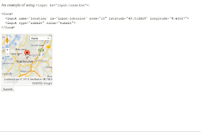

# &lt;input is="input-location"&gt;
================

A custom input element for selecting a loaction on a map.

###[Demo](http://jupiterrr.github.io/input-location-component/demo.html)

<!--See the [component page](http://jupiterrr.github.io/input-location-component/demo.html) for more information.

## Getting Started

We've put together a [guide to seed-element](http://www.polymer-project.org/docs/start/reusableelements.html) to help get you rolling.
-->